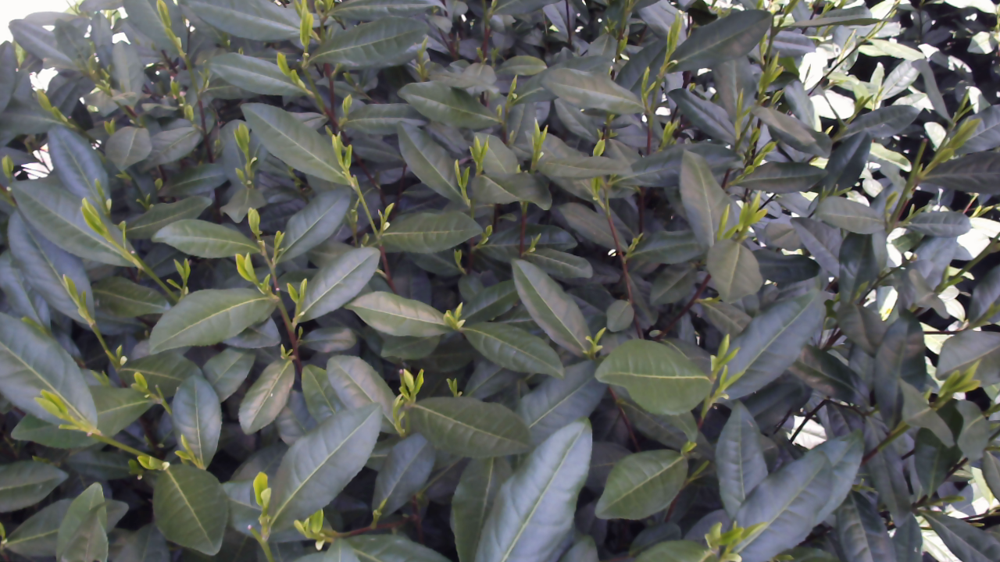

# 📖 FFLO-Net
Stereo Matching Network for Tea Shoots.

## 📁 File Tree

```
├── /FFLO-Net
    ├── core                   # Standard Version
    ├── core_depthany          # DepthAnything Version
        ├── depth_anything_v2
    ├── core_rt                # Real-time Version
    ├── demo-imgs
    ├── demo-output
    ├── pretrained_models
        ├── dpt
            ├── depth_anything_v2_vitl.pth
        ├── sceneflow
            ├── FFLONet_DepthAny.pth # DepthAnything Version
            ├── FFLONet.pth          # Standard Version
            ├── rt_FFLONet.pth       # Real-time Version
        ├── kitti
        ├── eth3d
        ├── middlebury
        ├── mix
    ├── demo_imgs_depthany.py
    ├── demo_imgs_rt.py
    ├── demo_imgs.py
    ├── README.md
```

## ⚙️ Environment
* NVIDIA RTX 3090
* Python 3.12
* Pytorch 2.8.0

### ⏳ Create a virtual environment and activate it.

```Shell
conda create -n FFLONet python=3.12
conda activate FFLONet
```

### ⏳ Dependencies

```Shell
pip install torch==2.8.0 torchvision==0.23.0 torchaudio==2.8.0 --index-url https://download.pytorch.org/whl/cu128
pip install opencv-python
pip install scikit-image
pip install tensorboard
pip install matplotlib 
pip install tqdm
pip install timm
pip install einops
pip install xformers==0.0.32.post1 # For dpt_FFLONet: DepthAnythingV2 && Pytorch 2.8.0
pip install "triton-windows<3.5"   # For dpt_FFLONet: DepthAnythingV2 && Pytorch 2.8.0
```

## ✏️ Required Data

* [SceneFlow](https://lmb.informatik.uni-freiburg.de/resources/datasets/SceneFlowDatasets.en.html)
* [KITTI](https://www.cvlibs.net/datasets/kitti/eval_scene_flow.php?benchmark=stereo)
* [ETH3D](https://www.eth3d.net/datasets)
* [Middlebury](https://vision.middlebury.edu/stereo/submit3/)
* [TartanAir](https://github.com/castacks/tartanair_tools)
* [CREStereo Dataset](https://github.com/megvii-research/CREStereo)
* [FallingThings](https://research.nvidia.com/publication/2018-06_falling-things-synthetic-dataset-3d-object-detection-and-pose-estimation)
* [InStereo2K](https://github.com/YuhuaXu/StereoDataset)
* [Sintel Stereo](http://sintel.is.tue.mpg.de/stereo)

```
├── /data
    ├── sceneflow
        ├── frames_cleanpass
        ├── frames_finalpass
        ├── disparity
    ├── KITTI
        ├── KITTI_2012
            ├── training
            ├── testing
        ├── KITTI_2015
            ├── training
            ├── testing
    ├── Middlebury
        ├── trainingH
        ├── trainingH_GT
    ├── ETH3D
        ├── two_view_training
        ├── two_view_training_gt
    ├── TartanAir
        ├── training
        ├── testing
    ├── CREStereo
        ├── hole
        ├── reflective
        ├── shapenet
        ├── tree
    ├── FallingThings
        ├── mixed
        ├── single
    ├── InStereo2K
        ├── training
        ├── testing
    ├── Sintel Stereo
        ├── training
```

## ✈️ Demo

To predict disparity on images in a folder, run

```Shell
python demo_imgs_rt.py --left_imgs './demo-imgs/*Left.png' --right_imgs './demo-imgs/*Right.png'
```

## 🎨 Visualization of Disparity Prediction Results
<div align="center">
    <div style="display: inline-block; width: 100%;">
        
        <p style="text-align: center; margin-top: 5px; color: #000000;">Left Image</p>
    </div>
    <div style="display: inline-block; width: 100%;">
        
        <p style="text-align: center; margin-top: 5px; color: #ff0000;">FFLONet + sceneflow</p>
    </div>
    <div style="display: inline-block; width: 100%;">
        
        <p style="text-align: center; margin-top: 5px; color: #0000ff;">RTFFLONet + sceneflow</p>
    </div>
    <div style="display: inline-block; width: 100%;">
        
        <p style="text-align: center; margin-top: 5px; color: #ff00ff;">FFLONetDepthAny + sceneflow</p>
    </div>
</div>

## 🔗 Acknowledgements

This project is heavily based on
[GwcNet](https://github.com/xy-guo/GwcNet),
[CFNet](https://github.com/gallenszl/CFNet),
[IGEV-Stereo](https://github.com/gangweiX/IGEV),
[DLNR](https://github.com/David-Zhao-1997/High-frequency-Stereo-Matching-Network),
[MoCha-Stereo](https://github.com/ZYangChen/MoCha-Stereo),
[DEA-Net](https://github.com/cecret3350/DEA-Net),
we thank the original authors for their excellent works.
